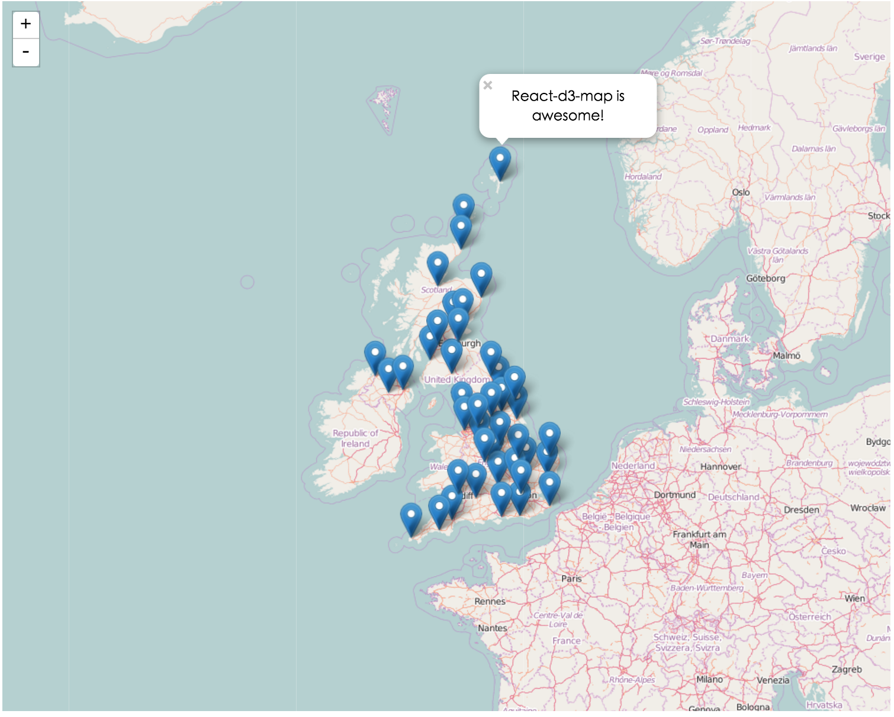

# react-d3-map

react-d3 interactive map, just like Leaflet!!! But BYE BYE layers!!!! We use SVG components to replace layers!!!

## Install

```
npm install react-d3-map
```

## LIVE DEMO

#### Multipolygon and Polygon

- http://interactive.reactd3.org/test-multipolygon.html
- http://interactive.reactd3.org/test-polygon.html

#### Markers and Points

- http://interactive.reactd3.org/test-point.html

#### LineString and MultiLineString

- http://interactive.reactd3.org/test-line.html

## Examples

#### Polygon and MultiPolygon

```js

(function() {
  var width = 1000;
  var height = 800;
  var scale = 1 << 12;
  var scaleExtent = [1 << 10, 1 << 14]
  var center = [-100.95, 40.7];
  var data = require('json!../data/states.json');

  var onPolygonMouseOut= function(component, d, i) {
    console.log('out')
    component.hidePopup();
  }
  var onPolygonMouseOver= function(component, d, i) {
    console.log('over')
    component.showPopup();
  }
  var onPolygonClick= function(component, d, i) {
    // component.showPopup();
  }
  var onPolygonCloseClick= function(component, id) {
    // component.hidePopup();
  }
  var popupContent = function(d) { return 'hi, i am polygon'; }

  var Container = React.createClass({
    render: function() {
      return (
        <g>
          <PolygonGroup
            key= {"polygon-test"}
            data= {data}
            popupContent= {popupContent}
            onClick= {onPolygonClick}
            onCloseClick= {onPolygonCloseClick}
            onMouseOver= {onPolygonMouseOver}
            onMouseOut= {onPolygonMouseOut}
            polygonClass= {"your-polygon-css-class"}
          />
        </g>
      )
    }
  })

  ReactDOM.render(
    <Map
      width= {width}
      height= {height}
      scale= {scale}
      scaleExtent= {scaleExtent}
      center= {center}
      clip={true}
      bounds={[[0, 0], [width, height]]}
    >
      <Container/>
    </Map>
  , document.getElementById('blank-multipolygon')
  )

})()

```


#### LineString and MultiLineString

```js

var Map = require('react-d3-map').Map;

var LineGroup = require('react-d3-map').LineGroup;


(function() {
  var width = 1000;
  var height = 800;
  var scale = 1 << 22;
  var scaleExtent = [1 << 20, 1 << 24]
  var center = [-122.486052, 37.830348];
  var popupContent = function(d) { return d.properties.text; }

  var data = {
          "type": "Feature",
          "properties": {},
          "geometry": {
              "type": "LineString",
              "coordinates": [
                  [-122.48369693756104, 37.83381888486939],
                  [-122.48348236083984, 37.83317489144141],
                  [-122.48339653015138, 37.83270036637107],
                  [-122.48356819152832, 37.832056363179625],
                  [-122.48404026031496, 37.83114119107971],
                  [-122.48404026031496, 37.83049717427869],
                  [-122.48348236083984, 37.829920943955045],
                  [-122.48356819152832, 37.82954808664175],
                  [-122.48507022857666, 37.82944639795659],
                  [-122.48610019683838, 37.82880236636284],
                  [-122.48695850372314, 37.82931081282506],
                  [-122.48700141906738, 37.83080223556934],
                  [-122.48751640319824, 37.83168351665737],
                  [-122.48803138732912, 37.832158048267786],
                  [-122.48888969421387, 37.83297152392784],
                  [-122.48987674713133, 37.83263257682617],
                  [-122.49043464660643, 37.832937629287755],
                  [-122.49125003814696, 37.832429207817725],
                  [-122.49163627624512, 37.832564787218985],
                  [-122.49223709106445, 37.83337825839438],
                  [-122.49378204345702, 37.83368330777276]
              ]
          }
      }

  var onLineMouseOut= function(component , d, i) {
    component.hidePopup();
    console.log('out')

  }
  var onLineMouseOver= function(component, d, i) {
    component.showPopup();
    console.log('over')
  }
  var onLineClick= function(component, d, i) {
    console.log('click')
  }
  var onLineCloseClick= function(componentcomponent, id) {
    console.log('close click')
  }


  ReactDOM.render(
    <Map
      width= {width}
      height= {height}
      scale= {scale}
      scaleExtent= {scaleExtent}
      center= {center}
    >
      <LineGroup
        key= {"line-test"}
        data= {data}
        popupContent= {popupContent}
        onClick= {onLineClick}
        onCloseClick= {onLineCloseClick}
        onMouseOver= {onLineMouseOver}
        onMouseOut= {onLineMouseOut}
        meshClass= {"your-line-css-class"}
      />
    </Map>
  , document.getElementById('blank-line')
  )

})()
```


#### Points and Markers

```js

var Map = require('react-d3-map').Map;
var MarkerGroup = require('react-d3-map').MarkerGroup;


// Example
(function() {
  var width = 1000;
  var height = 800;
  var scale = 1200 * 5;
  var scaleExtent = [1 << 12, 1 << 13]
  var center = [-5, 55.4];
  var uk = require('json!../data/uk.json');
  var data = topojson.feature(uk, uk.objects.places);
  var popupContent = function(d) { return d.properties.name; }
  var onMarkerMouseOut= function(component, d, i) {
    console.log('out')
  }
  var onMarkerMouseOver= function(component, d, i) {
    console.log('over')
  }
  var onMarkerClick= function(component, d, i) {
    component.showPopup();
    console.log('click')
  }
  var onMarkerCloseClick= function(component, id) {
    component.hidePopup();
    console.log('close click')
  }


  ReactDOM.render(
    <Map
      width= {width}
      height= {height}
      scale= {scale}
      scaleExtent= {scaleExtent}
      center= {center}
    >
      <MarkerGroup
        key= {"polygon-test"}
        data= {data}
        popupContent= {popupContent}
        onClick= {onMarkerClick}
        onCloseClick= {onMarkerCloseClick}
        onMouseOver= {onMarkerMouseOver}
        onMouseOut= {onMarkerMouseOut}
        markerClass= {"your-marker-css-class"}
      />
    </Map>
  , document.getElementById('blank-point')
  )

})()
```




## With ZoomControl

You have to add your ZoomControl panel by default using `ZoomControl` component in `react-d3-map-core`.  And send your `zoomScale` props in `Map` component, to achieve the zoomIn and zoomOut effect.

```js
"use strict";

var React = require('react');
var ReactDOM = require('react-dom');
var topojson = require('topojson');

var Map = require('react-d3-map').Map;
var ZoomControl = require('react-d3-map-core').ZoomControl;

var css= require('./css/polygon.css');

// Example
(function() {
  var width = 1000;
  var height = 800;
  var scale = (1 << 18);
  var center = [-73.95, 40.7];
  var data = {geometry: {coordinates: [[[-74.0479, 40.8820], [-73.9067, 40.8820], [-73.9067, 40.6829], [-74.0479, 40.6829], [-74.0479, 40.8820]]], type: "Polygon"}, id: 999999, properties:{"text": "hi, this is a polygon!"}, type: "Feature"};
  var popupContent = function(d) { return d.properties.text; }

  var Container = React.createClass({
    getInitialState: function() {
      return {
        scale: scale
      }
    },
    zoomOut: function() {
      this.setState({
        scale: this.state.scale / 2
      })
    },
    zoomIn: function() {
      this.setState({
        scale: this.state.scale * 2
      })
    },
    render: function() {

      var zoomIn = this.zoomIn;
      var zoomOut = this.zoomOut;

      var styleContainer = {
        position: 'relative',
        backgroundColor: '#EEE',
        width: width
      }

      return (
        <div style= {styleContainer}>
          <Map
            width= {width}
            height= {height}
            scale= {scale}
            zoomScale= {this.state.scale}
            center= {center}
            data= {data}
            popupContent= {popupContent}
          />
          <ZoomControl
            zoomInClick= {zoomIn}
            zoomOutClick= {zoomOut}
          />
        </div>
      )
    }
  })

  ReactDOM.render(
    <Container/>
  , document.getElementById('blank-container')
  )

})()

```

## Svg in Map

One of the most powerful part of `react-d3-map` is you can easy put all your svg tags and component inside your map, without any efforts

```js
ReactDOM.render(
  <Map
    width= {width}
    height= {height}
    scale= {scale}
    scaleExtent= {scaleExtent}
    center= {center}
  >
    // you can put any svg inside here, such as <rect>, <text> ...
    <text
      x= {width / 2}
      y= {height/ 2}
    >
      HI, this is a text
    </text>
  </Map>
, document.getElementById('blank-point')
)
```


## License

Apache 2.0
